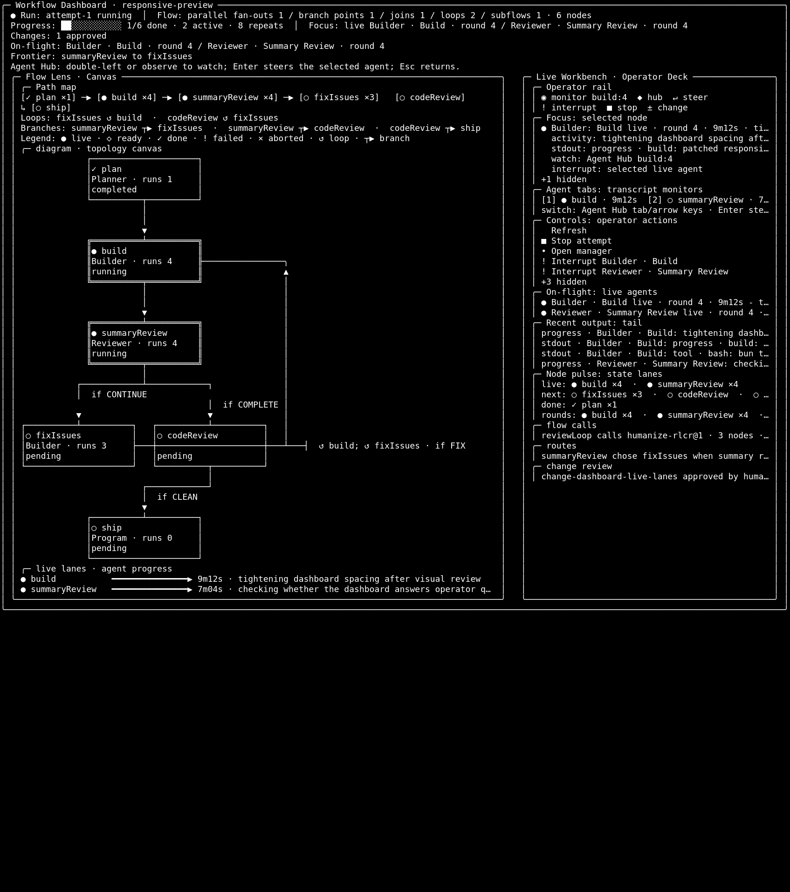

# Workflows

`omp` can run `.omhflow` workflow artifacts for mutable, auditable agentic
development flows. A workflow can be edited while it is in development, but a
production attempt runs against an immutable freeze. If the flow must change,
the operator stops the attempt, checkpoints it, applies an approved change,
freezes the new graph, and restarts from the checkpoint.

The workflow UI is still part of the interactive terminal coding tool. It is a
workflow-mode monitoring and intervention dashboard for `omp`, not a separate
replacement for the normal chat, tool, model, and file-editing experience.

## Artifact Shape

A distributable workflow has two parts:

```text
my-flow.omhflow
my-flow/
  prompts/
  scripts/
  fixtures/
```

The `.omhflow` file contains YAML frontmatter plus a fenced workflow block. The
same-name directory contains prompts, scripts, templates, fixtures, and other
resources. Resource paths inside the flow resolve from that same-name directory.

## Built-In Practical Flows

`omp` ships with built-in flows that can be addressed by name. A built-in flow
must be a practical, generic workflow: it should run in a user project
directory, take its task-specific goal from the operator or task artifacts, and
avoid bundled seed-project assumptions.

- `humanize-rlcr` — a Humanize-style review loop with implementation and review
  rounds. It is intended for interactive, task-driven implementation with
  explicit operator understanding and optional long-running evidence gates.
- `kda-humanize` — a KDA-style flow that imports a Humanize subflow.
  It is a project-generic KDA structure for contract, inspection, planning,
  candidate validation, and promotion; it is not GPU performance evidence unless
  the task and environment provide that validation.
- `parallel-implementation-review` — a compact parallel fan-out/gather
  implementation pattern with core, test, and docs/evidence branches, followed
  by integration review and final strong review.
- `agent-build-review-loop` — a generator/critic refinement loop for repeated
  build and review rounds. It uses `task.md` as the default task contract, and
  verification comes from commands declared by that contract.

The built-in set is intentionally small. Primitive examples, UX probes, and
seed-bound demos are useful for learning or validation, but they are not exposed
as named practical built-ins and should not be counted as reusable development
workflows. For example, `branch-conditional`, `loop-until-done`,
`parallel-join`, `human-interactive-dev`, and `recflow-lab-audit-events-demo`
are executable examples under the package's workflow demo directory; use them by
explicit artifact path when studying flow-language mechanics.

List available flows:

```sh
omp workflow list
```

Built-in flows are packaged workflow artifacts, not infrastructure
dependencies. The workflow runtime, freeze checker, resolver, and CLI must also
work with any valid standalone `.omhflow + same-name directory` artifact supplied
by path or through `OMHFLOW_DIR`.

The workflows below use the normal `omp` model, provider, auth, and tool settings.
The flow artifact can name portable defaults, but it does not carry API keys and
does not introduce a second model/tool configuration layer.

## Humanize RLCR Workflow

Use `humanize-rlcr` when a task needs iterative implementation with explicit
review gates. The flow models plan compliance, a human understanding gate,
implementation/review looping, code-review cleanup, and final alignment.

Prepare a project directory with a task brief:

```sh
mkdir -p demo-humanize
cd demo-humanize
cat > task.md <<'EOF'
Goal: add a small documented behavior change and verify it locally.
Acceptance: implementation notes, tests or command output, and final summary.
EOF
```

Launch the TUI from the project directory:

```sh
omp
```

Start the flow interactively so the operator can observe the graph, answer the
human gate, interrupt agents, or approve changes:

```text
/workflow start humanize-rlcr --family-id demo-humanize --background
/workflow graph --family-id demo-humanize
/workflow manager --family-id demo-humanize
```

Production workflow starts and restarts have a default max runtime of five days.
When that deadline elapses, `omp` stops scheduling new nodes, aborts in-flight
nodes, and records a checkpoint that can be restarted. Use `--max-runtime-ms`
when a shorter smoke or validation bound is needed.

Long-running evidence has a separate lower bound: a Project x Flow x Task run
must remain active for more than eight hours to count as long-running. Shorter
runs are useful smoke evidence, but they are not long-running validation.

In the workflow graph, expect the implementation loop to revisit the build and
summary-review nodes until the reviewer returns `COMPLETE`. If long-running
evidence was requested and the eight-hour floor is still pending, the flow moves
to a lightweight hold/check loop instead of asking the builder to keep expanding
the patch. Once the floor is satisfied, the code-review loop runs until the
reviewer returns `CLEAN`. Node badges show how many times each node has fired,
which is the useful signal for long-running RLCR work.

For a bounded smoke run without opening the TUI, stop after the first script
activation so the headless command verifies resolution, freeze, and runtime
wiring without trying to answer the human gate:

```sh
omp workflow start humanize-rlcr \
  --cwd "$PWD" \
  --run-id demo-humanize-smoke \
  --max-activations 1 \
  --json
```

The headless path is useful for freeze/runtime checks. Human nodes, active-agent
steering, and workflow mutation are TUI-first.

## KDA Workflow

Use `kda-humanize` when a task needs a KDA-style outer flow that
loads a task contract, inspects the workspace, drafts a plan, then calls
Humanize as a reusable subflow before candidate validation and promotion.

Prepare a project directory:

```sh
mkdir -p demo-kda
cd demo-kda
cat > task.md <<'EOF'
Task contract: inspect this project, draft a plan, use the Humanize subflow to
iterate, then record evidence for promotion.
EOF
```

Launch the TUI from the project directory:

```sh
omp
```

Run it in the TUI:

```text
/workflow start kda-humanize --family-id demo-kda --background
/workflow graph --family-id demo-kda
/workflow manager --family-id demo-kda
```

The resident graph should show the imported Humanize subflow as a function-like
call boundary, while diagnostics keep source mapping and namespace details
available for inspection. The outer KDA flow first loads `task.md` as the
immutable task contract, inspects the workspace, drafts a plan, enters the
imported Humanize loop, validates the candidate against the nested Humanize
handoff, and records promotion evidence.

For non-interactive validation, freeze the packaged artifact or run a bounded
headless smoke from a project directory that contains `task.md`. Full KDA runs
still become TUI-first once the imported Humanize subflow reaches its human
understanding gate:

```sh
omp workflow freeze kda-humanize --json
omp workflow start kda-humanize --json --max-activations 1
```

## Interactive Use

Use `/workflow` inside the TUI when a human operator should observe, steer,
interrupt, approve changes, or restart attempts.

```text
/workflow start humanize-rlcr --family-id my-feature --background
/workflow graph --family-id my-feature
/workflow manager --family-id my-feature
/workflow stop my-run:attempt-1 --deadline-ms 30000
/workflow restart my-run:attempt-1:checkpoint-1 --freeze-id flowfreeze:...
```

`/workflow start <flow-or-path>` accepts either a named built-in or installed
flow, a direct `.omhflow` path, a workflow YAML file, or a directory containing
`workflow.yml`.

### Workflow Dashboard

When a workflow is running, the TUI keeps a resident dashboard instead of
printing a new graph into scrollback on every refresh. The left Flow Lens is the
topology canvas: it shows directed edges, loopback rails, branch hints,
subflow/function-call boundaries, current node status, per-node run counts, and
live lanes for active agent progress. Conditional edges use compact decision
chips such as `if CONTINUE`, while the full route condition remains available in
the routes and review details. The right Operator Deck is the human intervention
surface: its top Operator rail keeps the selected live agent and its watch,
Agent Hub, steer, interrupt, stop, restart, and change affordances visible
before the focused node, transcript monitor tabs, on-flight work, recent output,
and compact node-state lanes. Progress and node-pulse summaries distinguish
live/running work from checkpoint frontiers, so a stopped but resumable node is
shown as `frontier` rather than as active on-flight work; the graph legend uses
the same `◇ frontier` label. On short terminals, the rail collapses to one
action row so intervention controls stay visible while less urgent detail is
clipped. Live agent targets are labeled as `monitor`;
non-live frontier or focused nodes are labeled as `focus` so the dashboard does
not imply an Agent Hub transcript exists when there is no running agent to
attach to. The right panel is titled `Live Workbench` only when actual work is
running; stopped and checkpoint-frontier views use `Operator Deck`. When a
checkpointed attempt can resume, `restart` is promoted into the same rail so the
next safe lifecycle action is visible without opening the command list.



Treat a running agent or review node like a workflow-owned subagent. The
dashboard exposes each live agent as an Agent Hub target with a stable tab label
and focus id. Use the Agent Hub view to inspect the agent transcript, watch tool
calls, steer the selected agent, interrupt one agent without stopping siblings,
or return to the workflow dashboard. When several agent nodes are on-flight, the
`Agent tabs` row acts as the switcher: the selected tab is the node the Operator
Deck will steer, while the On-flight section keeps the rest visible. Interrupt
controls keep the human-facing node label so parallel agents with the same role
remain distinguishable. The Operator rail mirrors the selected tab, so the
default dashboard always shows what the next watch, steer, interrupt, stop, or
change action will target before the operator opens deeper details.

Nested subflows are displayed as function-like calls. The parent flow remains
the outer call frame, while imported subflow nodes keep their own names, entry
points, exits, and resource prefix available for inspection. If a node inside an
imported subflow becomes active, it appears in the same active-agent monitor and
can be opened through Agent Hub just like a top-level workflow agent. Namespace
and source-mapping details stay in diagnostics so the default view remains a
programmer cockpit rather than a lifecycle dump.

## Non-Interactive Use

Use `omp workflow` for scripting, CI-style checks, or deterministic workflow
smoke runs without opening the TUI.

```sh
omp workflow freeze humanize-rlcr
omp workflow start ./my-flow.omhflow --run-id run-1 --max-activations 20
omp workflow start humanize-rlcr --json --max-activations 1
omp workflow start humanize-rlcr --json --max-runtime-ms 60000
```

Headless workflow runs reuse the existing `omp` runtime boundary. Shell and JS
script nodes run directly. Agent and review nodes are delegated through the
normal `omp launch -p` path so model, provider, auth, tool, and settings
configuration stay in the existing oh-my-pi layer. Human nodes require the
interactive TUI path.

## Installing External Flows

External `.omhflow` artifacts are installed into the first directory from
`OMHFLOW_DIR`. If `OMHFLOW_DIR` is unset, `omp` uses `~/.omp/flows`.

```sh
omp workflow install ./my-flow.omhflow
omp workflow install ./my-flow.omhflow --force
omp workflow uninstall my-flow
```

`OMHFLOW_DIR` accepts a platform path list:

```sh
export OMHFLOW_DIR="$HOME/.omp/flows:$PWD/team-flows"
omp workflow list
omp workflow start team-release-hardening
```

For a named lookup, `omp` treats bundled and external artifacts as peers. A flow
name must resolve to exactly one artifact across bundled flows and
`OMHFLOW_DIR`; if a bundled flow and an external flow share the same name, the
lookup is rejected as ambiguous. Use an explicit `.omhflow` path to select a
specific artifact.
Each flow can be laid out either as `<dir>/<name>.omhflow` plus `<dir>/<name>/`,
or as `<dir>/<name>/<name>.omhflow` plus `<dir>/<name>/<name>/`.

## Authoring Notes

- Flows use the workflow infrastructure only through stable artifact/runtime
  interfaces: node types, declared resources, model/tool capabilities,
  workflow context, state, review verdicts, and lifecycle commands. They should
  not depend on `omp` source paths, private implementation details, or a special
  built-in execution path.
- Keep model and tool selections as portable defaults or capability
  declarations in the flow; actual resolution happens through `omp` settings and
  runtime configuration.
- Prefer small, reusable subflows over large monolithic graphs.
- Use review node outputs and edge conditions for loops such as
  `CONTINUE`/`COMPLETE` or `ISSUES`/`CLEAN`.
- Program nodes can read the current workflow execution context without
  scraping logs or raw transcripts. JS eval scripts receive `workflowContext`;
  shell scripts receive the same JSON as `OMP_WORKFLOW_CONTEXT`. Use it for
  durable flow state such as round ledgers, issue queues, and checkpointable
  progress summaries.
- Shell script nodes can read frozen workflow resources from
  `OMP_WORKFLOW_RESOURCE_DIR`. Declare every prompt, script, fixture, seed file,
  or other data file under `resources`; production runs materialize those frozen
  snapshots into that directory so scripts do not depend on the mutable source
  artifact path.
- Freeze a flow before treating it as production-safe:

```sh
omp workflow freeze ./my-flow.omhflow
```
